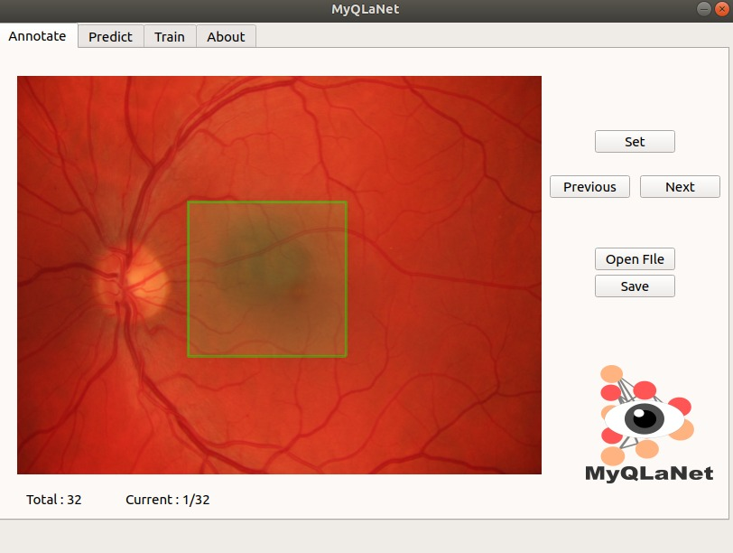

# MyQLaNet

  

A Deep Learning Platform for Macula Detection.

It provides end to end system for macula detection with graphical user interface.

## Dependencies

## Instalation

**Ubuntu Linux**

Python 3 + Qt5

~~~
sudo apt install pyqt5-dev-tools
sudo pip3 install -r requirements.txt
python3 app.py
~~~
